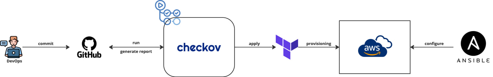
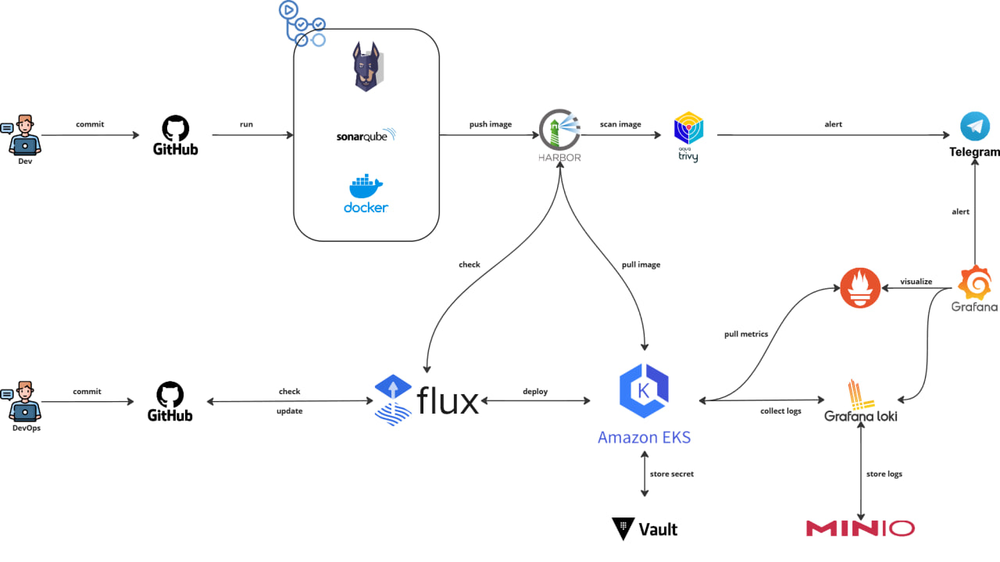

# Implementing a DevSecOps model for High Availability CI/CD System in Microservices environments

Welcome to the GitHub organization for the my team (Group 03). This organization hosts repositories for our project titled **Implementing a DevSecOps Model for a High Availability CI/CD System in a Microservices Environment**. Below, you'll find an overview of each repository and its purpose.

Our organization aims to implement a streamlined DevSecOps workflow for high availability and efficiency. Below are two diagrams that illustrate the core processes:

### Provisioning & Configuration Management

    </img>

### CI/CD Pipeline

    </img>

## Microservices Repositories

These repositories contain the source code for the microservices that make up the **Class Management** application:

### 1. [**class-management-FE**](https://github.com/NT548-P11-DevOps-Technology/class-management-FE)
- **Description**: Frontend application for the class management system.

### 2. [**class-management-auth-service**](https://github.com/NT548-P11-DevOps-Technology/class-management-auth-service)
- **Description**: Authentication service.

### 3. [**class-management-student-service**](https://github.com/NT548-P11-DevOps-Technology/class-management-student-service)
- **Description**: Handles operations related to student management.

### 4. [**class-management-lecturer-service**](https://github.com/NT548-P11-DevOps-Technology/class-management-lecturer-service)
- **Description**: Handles operations related to lecturer management.

### 5. [**class-management-class-service**](https://github.com/NT548-P11-DevOps-Technology/class-management-class-service)
- **Description**: Handles operations related to class management.

## Infrastructure Repositories

These repositories manage the infrastructure and deployment of the application:

### 👉 [**terraform-hub**](https://github.com/NT548-P11-DevOps-Technology/terraform-hub)
- **Description**: Contains Terraform scripts for infrastructure provisioning.
- **Technologies**: Terraform.
- **Purpose**: Automates the provisioning of cloud resources, including VPCs, subnets, EC2 instances, Amazon EKS, and other AWS services.

### 👉 [**ansible-hub**](https://github.com/NT548-P11-DevOps-Technology/ansible-hub)
- **Description**: Houses Ansible playbooks for configuration management.
- **Technologies**: Ansible.
- **Purpose**: Automates the configuration of servers, including software installations and environment setups.

### 👉 [**kubernetes-hub**](https://github.com/NT548-P11-DevOps-Technology/kubernetes-hub)
- **Description**: Contains Kubernetes manifests for deploying microservices.
- **Technologies**: Kubernetes, Helm.
- **Purpose**: Manages the deployment and scaling of microservices in the Kubernetes cluster.

## Contact

For any questions or issues, please reach out to the team through the repository's Issues section or contact the organization administrators directly.

---

We hope this documentation helps you navigate our repositories efficiently. Thank you for visiting our organization!