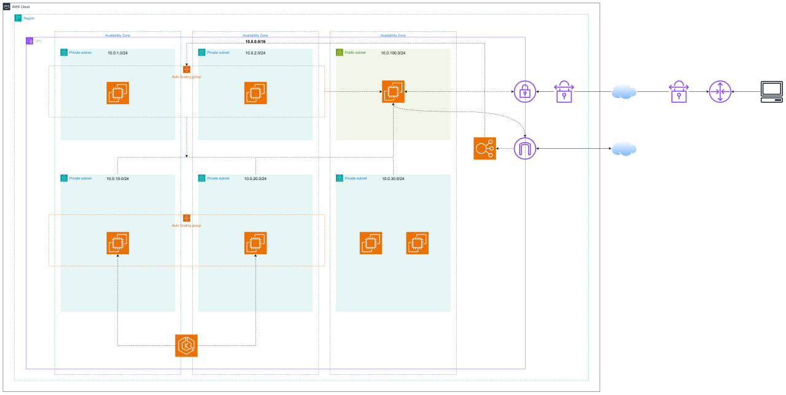

# Implementing a DevSecOps model for High Availability CI/CD System in Microservices environments

Welcome to our GitHub organization! This organization hosts repositories for our project titled **Implementing a DevSecOps Model for a High Availability CI/CD System in a Microservices Environment**. In the next section, you'll find an overview of each repository and its purpose.

Our organization aims to implement a streamlined DevSecOps workflow for high availability and efficiency. Below are the diagrams that illustrate the core processes:

## 🔧 1. Provisioning & Configuration Management

This module automates the setup of cloud resources and server configurations, ensuring a reproducible and scalable environment.

    </img>

## 🤖 2. CI/CD Pipeline

The CI/CD pipeline automates the build, test, security scanning, and deployment process, ensuring rapid and reliable software delivery.

    </img>

## ☁️ 3. Cloud Architecture

Our application is deployed on Amazon EKS for scalability and high availability.

    </img>

## 🏗️ System Overview

Our DevSecOps implementation is built around three main workflows:

### **1️⃣ Provisioning & Configuration Management**
- Automates infrastructure provisioning using **Terraform**.
- Implements configuration management with **Ansible**.
- Uses **Checkov** for security scanning of infrastructure-as-code.

### **2️⃣ CI/CD Pipeline with Security Integration**
- Developers commit code to **GitHub repositories**.
- CI pipeline is automatically triggered upon commit.
- Security scanning:
  - **Snyk** scans dependencies for vulnerabilities.
  - **SonarQube** checks code quality and security issues.
- If checks pass, the container image is built and pushed to **Harbor Registry**.
- **Trivy** scans the container images for vulnerabilities and reports results.
- **FluxCD** monitors changes and automatically deploys updates to **Kubernetes**.
- Manages secrets securely via **HashiCorp Vault**.

### **3️⃣ Operations & Monitoring**
- Applications are deployed on **Amazon EKS (Elastic Kubernetes Service)**.
- **Prometheus** collects real-time performance metrics.
- **Grafana** visualizes monitoring data for system insights.
- **Loki** aggregates logs for debugging and auditing.
- **Alerting system via Telegram** notifies engineers of anomalies.
- **MinIO** stores historical logs for long-term analysis.

## 📂 Repository Structure

### Microservices Repositories

These repositories contain the source code for the microservices that make up the **Class Management** application:

1. [**class-management-FE**](https://github.com/NT548-P11-DevOps-Technology/class-management-FE): Frontend application for the class management system.

2. [**class-management-auth-service**](https://github.com/NT548-P11-DevOps-Technology/class-management-auth-service): Authentication service.

3. [**class-management-student-service**](https://github.com/NT548-P11-DevOps-Technology/class-management-student-service): Handles operations related to student management.

4. [**class-management-lecturer-service**](https://github.com/NT548-P11-DevOps-Technology/class-management-lecturer-service): Handles operations related to lecturer management.

5. [**class-management-class-service**](https://github.com/NT548-P11-DevOps-Technology/class-management-class-service): Handles operations related to class management.

### Infrastructure Repositories

These repositories manage the infrastructure and deployment of the application:

👉 [**terraform-hub**](https://github.com/NT548-P11-DevOps-Technology/terraform-hub)
- **Description**: Contains Terraform scripts for infrastructure provisioning.
- **Technologies**: Terraform.
- **Purpose**: Automates the provisioning of cloud resources, including VPCs, subnets, EC2 instances, Amazon EKS, and other AWS services.

    </img>

👉 [**ansible-hub**](https://github.com/NT548-P11-DevOps-Technology/ansible-hub)
- **Description**: Houses Ansible playbooks for configuration management.
- **Technologies**: Ansible.
- **Purpose**: Automates the configuration of servers, including software installations and environment setups.

    </img>

👉 [**kubernetes-hub**](https://github.com/NT548-P11-DevOps-Technology/kubernetes-hub)
- **Description**: Contains Kubernetes manifests for deploying microservices.
- **Technologies**: Kubernetes, Helm.
- **Purpose**: Manages the deployment and scaling of microservices in the Kubernetes cluster.

    </img>

## 📖 Project Documentation

Report document can be found [here](../materials/NT548.P11_NHOM03.pdf).

## 🔗 References

Below are the official documentation links for the key technologies used in this project:

- [Terraform](https://developer.hashicorp.com/terraform/docs)

- [Ansible](https://docs.ansible.com)

- [Docker](https://docs.docker.com)

- [Kubernetes](https://kubernetes.io/docs)

- [GitHub Actions](https://docs.github.com/en/actions)

- [FluxCD](https://fluxcd.io/docs)

- [Checkov](https://www.checkov.io/1.Welcome/Quick%20Start.html)

- [Snyk](https://snyk.io/docs)

- [SonarQube](https://docs.sonarqube.org)

- [Trivy](https://aquasecurity.github.io/trivy)

- [HashiCorp Vault](https://developer.hashicorp.com/vault/docs)

- [Harbor Registry](https://goharbor.io/docs)

- [Prometheus](https://prometheus.io/docs)

- [Grafana](https://grafana.com/docs)

- [Loki](https://grafana.com/docs/loki/latest)

## 💪 Contact

For any questions or issues, please reach out to the team through the repository's Issues section or contact the organization administrators directly.
